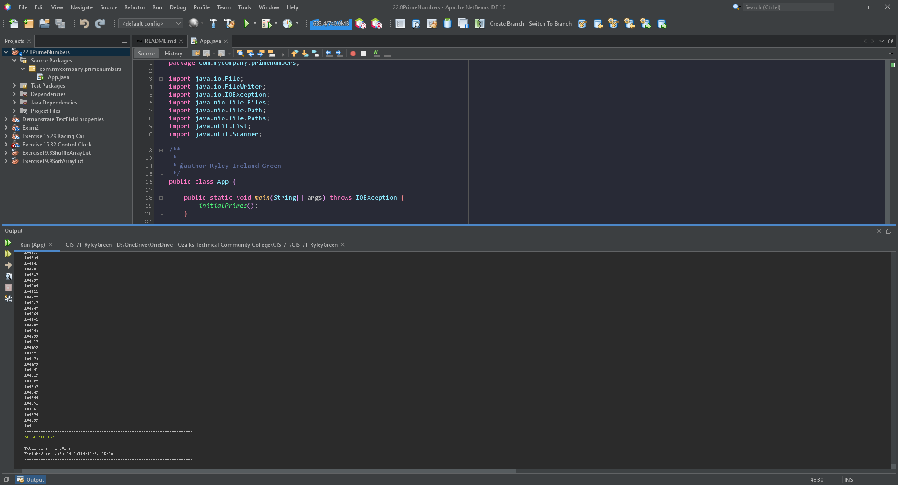

# Exercise 22.8 All prime numbers up to

All prime numbers up to 1,000,000,000 Write a program that finds all prime numbers up to 1,000,000,000.
There are approximately 455,052,511 such prime numbers. Your program should meet the following requirements: • Your program should store the prime numbers in a binary data file, named PrimeNumbers.dat. 
When a new prime number is found, the number is appended to the file. • To find whether a new number is prime, your program should load the prime numbers from the file to an array of the long type of size 10000.
If no number in the array is a divisor for the new number, continue to read the next 10000 prime numbers from the data file, until a divisor is found or all numbers in the file are read. If no divisor is found, the new number is prime.  
If the machine is shut down and rebooted, your program should resume by using the prime numbers stored in the binary data file rather than start over from scratch.

## Example Output

## Analysis Steps

Create a file "PrimeNumbers.dat" to store prime numbers and use that file to add more prime numbers through comparison.

### Design

Method that determines if a number is prime. Method for initialising first set of primes in a file. last method to use intervals of 10000 primes for finding more primes.

### Testing

First tested a method for finding out if a single number was prime (worked)
Added looping and file storing and tested by reading primes from file (worked)
Started to store primes in array of 10000 (broke)
Removed array and retested file reading (broke?)
Tested multiple forms of prime checking (breaks my pc (or IDE?) when using small or large amount of numbers)
Last test was done with the semi-working build that displays a large amount of primes (close to 10,000 but it breaks and skips some and some numbers might only be partially shown(not sure why they would only be partial when they are whole integers converted to strings))

## Adapted from a README Built With

* [Dropwizard](http://www.dropwizard.io/1.0.2/docs/) - The web framework used
* [Maven](https://maven.apache.org/) - Dependency Management
* [ROME](https://rometools.github.io/rome/) - Used to generate RSS Feeds

## Contributing

Please read [CONTRIBUTING.md](https://gist.github.com/PurpleBooth/b24679402957c63ec426) for details on our code of conduct, and the process for submitting pull requests to us.

## Versioning

We use [SemVer](http://semver.org/) for versioning. For the versions available, see the [tags on this repository](https://github.com/your/project/tags). 

## Authors

* **Billie Thompson** - *Initial work* - [PurpleBooth](https://github.com/PurpleBooth)

See also the list of [contributors](https://github.com/your/project/contributors) who participated in this project.

## License

This project is licensed under the MIT License - see the [LICENSE.md](LICENSE.md) file for details

## Acknowledgments

* Hat tip to anyone who's code was used
* Inspiration
* etc
