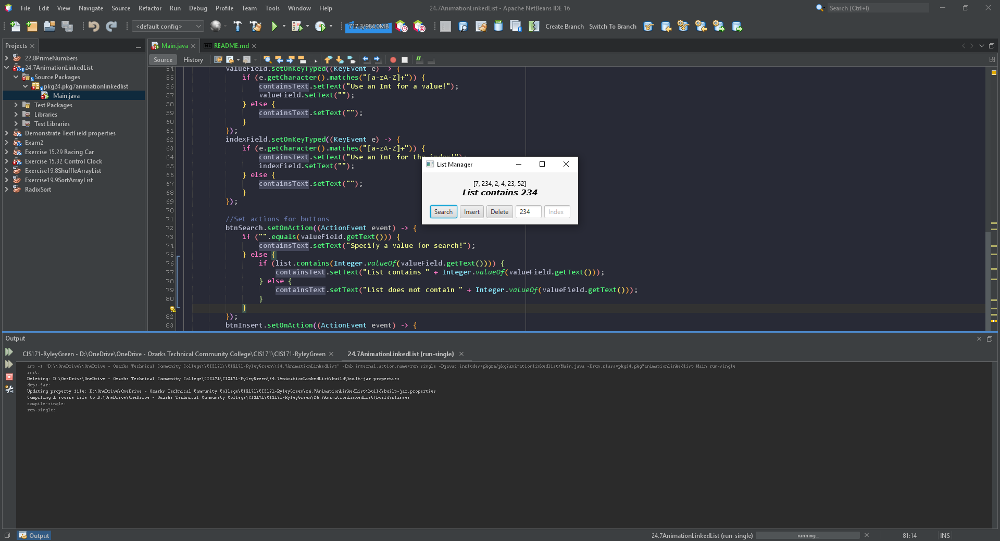

# Exercise 24.7 Animation: linked list

A working GUI for searching, inserting, and deleting values in a list; additional functionality through the ability to insert at specific index.

## Example Output

## Analysis Steps

Add three buttons and two textfield for the general functionality and two more labels for presenting outputs.

### Design

I used a vbox for general layout two labels near the top and hbox to hold a row of tools for interacting with the list below the labels. Action events add funtionality to the buttons and some checks are in place that display warnings.

### Testing

The first test was to place the tools within the hbox and place them at the bottom center.

The next test had the tools placed into a vbox and the labels place above the tools, also centered.

Another test was done to display the list on the gui.

The first interaction test was done when testing the insert button with a value in the value textfield.

The same tests were done for the search and delete buttons for the value field.

then the last test was done after the index field was operational for the insert button.

## Adapted from a README Built With

* [Dropwizard](http://www.dropwizard.io/1.0.2/docs/) - The web framework used
* [Maven](https://maven.apache.org/) - Dependency Management
* [ROME](https://rometools.github.io/rome/) - Used to generate RSS Feeds

## Contributing

Please read [CONTRIBUTING.md](https://gist.github.com/PurpleBooth/b24679402957c63ec426) for details on our code of conduct, and the process for submitting pull requests to us.

## Versioning

We use [SemVer](http://semver.org/) for versioning. For the versions available, see the [tags on this repository](https://github.com/your/project/tags). 

## Authors

* **Billie Thompson** - *Initial work* - [PurpleBooth](https://github.com/PurpleBooth)

See also the list of [contributors](https://github.com/your/project/contributors) who participated in this project.

## License

This project is licensed under the MIT License - see the [LICENSE.md](LICENSE.md) file for details

## Acknowledgments

* Hat tip to anyone who's code was used
* Inspiration
* etc
