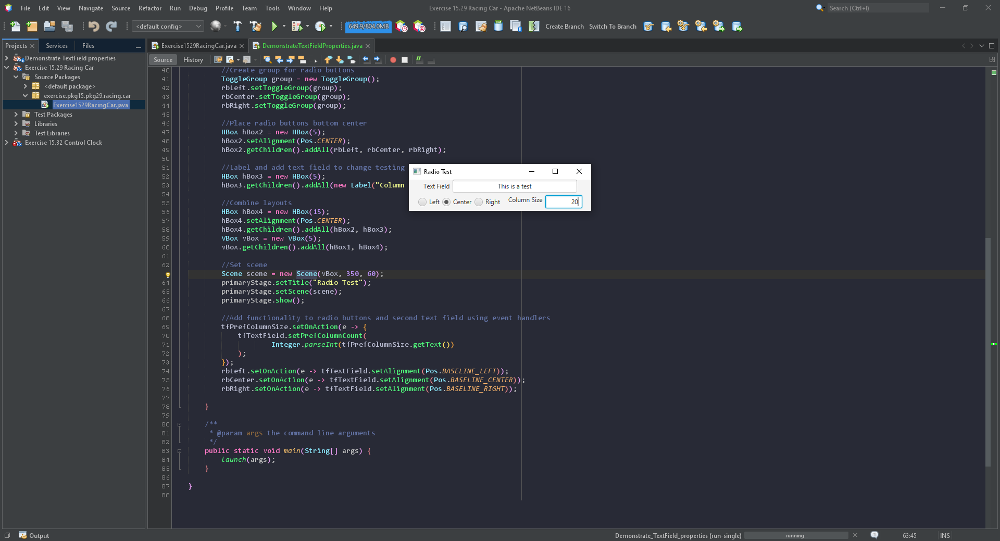

# Exercise 16.6 Demonstrate Text field properties

Write a program that sets the horizontal-alignment and column-size properties of a text field dynamically.

## Example Output

## Analysis Steps

Follow the steps needed to create a text field with options to change column size and alignment dynamically.

### Design

a text field of testing that allows a user to input text.
radio buttons to allow the user to dynamically change the chosen text's alignment (Left, Center, and Right.)
and an Additional text field will allow the user to change the initial testing text field's column size through the input of integers.

### Testing

After the inital layout was complete a test run was used to make sure everything was in the correct place.
The radio buttons were then added to a group and tested for interaction.
another test was done after the radio buttons and column size text field were both given functionality.
The final test was done after adjustiing the scene size a bit and everything was working.

## Adapted from a README Built With

* [Dropwizard](http://www.dropwizard.io/1.0.2/docs/) - The web framework used
* [Maven](https://maven.apache.org/) - Dependency Management
* [ROME](https://rometools.github.io/rome/) - Used to generate RSS Feeds

## Contributing

Please read [CONTRIBUTING.md](https://gist.github.com/PurpleBooth/b24679402957c63ec426) for details on our code of conduct, and the process for submitting pull requests to us.

## Versioning

We use [SemVer](http://semver.org/) for versioning. For the versions available, see the [tags on this repository](https://github.com/your/project/tags). 

## Authors

* **Billie Thompson** - *Initial work* - [PurpleBooth](https://github.com/PurpleBooth)

See also the list of [contributors](https://github.com/your/project/contributors) who participated in this project.

## License

This project is licensed under the MIT License - see the [LICENSE.md](LICENSE.md) file for details

## Acknowledgments

* Hat tip to anyone who's code was used
* Inspiration
* etc
