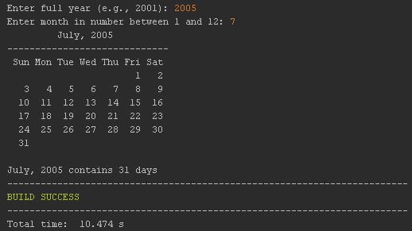

# Exercise 13.4 Display Calendars

Takes user input for a year and month, then display calendar. Amount of days found in given month is also displayed after calendar is displayed.

## Example Output

## Analysis Steps

Display a calendar for a specified month and year using Calendar and gregorianCalendar classes. Print the amount of days in the given month of the year after the calendar.

### Design

I used the pre-defined class and methods to display a calendar and grab information on the user inputted month.

### Testing

Firstly testing the current state of the class compared to the request information
by running the code once.

Second add a print line with test text to make sure it's placed under the calendar.

Third fill the print line with required information then run.

## Do not change content below this line
## Adapted from a README Built With

* [Dropwizard](http://www.dropwizard.io/1.0.2/docs/) - The web framework used
* [Maven](https://maven.apache.org/) - Dependency Management
* [ROME](https://rometools.github.io/rome/) - Used to generate RSS Feeds

## Contributing

Please read [CONTRIBUTING.md](https://gist.github.com/PurpleBooth/b24679402957c63ec426) for details on our code of conduct, and the process for submitting pull requests to us.

## Versioning

We use [SemVer](http://semver.org/) for versioning. For the versions available, see the [tags on this repository](https://github.com/your/project/tags). 

## Authors

* **Billie Thompson** - *Initial work* - [PurpleBooth](https://github.com/PurpleBooth)

See also the list of [contributors](https://github.com/your/project/contributors) who participated in this project.

## License

This project is licensed under the MIT License - see the [LICENSE.md](LICENSE.md) file for details

## Acknowledgments

* Hat tip to anyone who's code was used
* Inspiration
* etc
