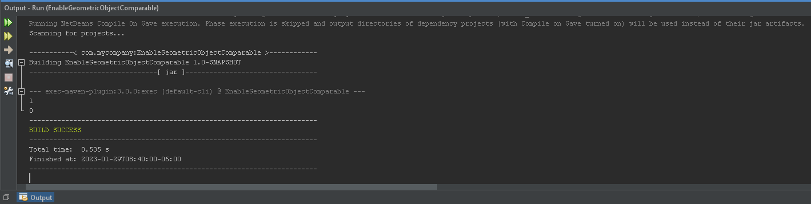

# EnableGeometricObjectComparable

Allows user to create circles and rectangles of different sizes, then compare them to each other to determine the largest object.

## Example Output

## Analysis Steps

Modify the GeometricObject class to include the comparable interface allowing for the comparison between object sizes.

### Design

I used the included classes and methods for the creation of objects, with modification to compare sizes. An additional class was created for testing purposes.

### Testing

Firstly I tested the interaction between the GeometricObject and Circle/Rectangle classes for object creation. 

Secondly a placeholder for the compareTo method executed a similar task

Last the placeholder was further developed into the compareTo method and tested for each common result.

## Adapted from a README Built With

* [Dropwizard](http://www.dropwizard.io/1.0.2/docs/) - The web framework used
* [Maven](https://maven.apache.org/) - Dependency Management
* [ROME](https://rometools.github.io/rome/) - Used to generate RSS Feeds

## Contributing

Please read [CONTRIBUTING.md](https://gist.github.com/PurpleBooth/b24679402957c63ec426) for details on our code of conduct, and the process for submitting pull requests to us.

## Versioning

We use [SemVer](http://semver.org/) for versioning. For the versions available, see the [tags on this repository](https://github.com/your/project/tags). 

## Authors

* **Billie Thompson** - *Initial work* - [PurpleBooth](https://github.com/PurpleBooth)

See also the list of [contributors](https://github.com/your/project/contributors) who participated in this project.

## License

This project is licensed under the MIT License - see the [LICENSE.md](LICENSE.md) file for details

## Acknowledgments

* Hat tip to anyone who's code was used
* Inspiration
* etc
