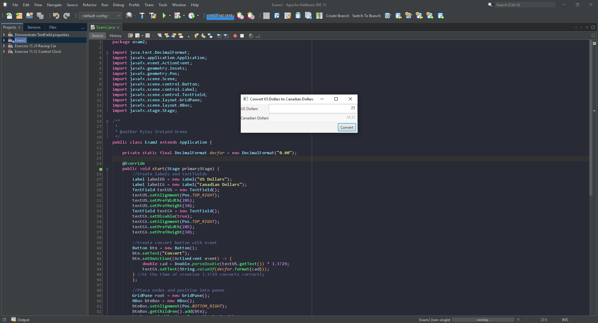

# Exam2

A GUI for USD to CAD currency conversion.

## Example Output

## Analysis Steps

Using different types of nodes create a readable GUI for the purpose of currency conversion between USD and CAD, Then add the functionality to those nodes to operate.

### Design

When designing the GUI I tried to stay closely to the provided example output. I started with the creation of the nodes from the example, two labels, two text fields, and a button.
Each node was placed into a grid and positioned, except for the button that got its own HBox for easy individual padding for the button. After the layout was complete the functionality was added.

### Testing

The first test was done for positioning after placing the nodes into the grid pane.

Then some small tweaks like textfield size and button placement to match a bit more with the example got tested.

A test was done by just taking the input from USD and setting it as the CAD with no conversion.

After the initial test worked I made a conversion and sent the converted amount instead.

I then rounded the output to more resemble the currecny.

The last test was inputting a few currency amounts and comparing to the google converion output to test accuracy.

## Adapted from a README Built With

* [Dropwizard](http://www.dropwizard.io/1.0.2/docs/) - The web framework used
* [Maven](https://maven.apache.org/) - Dependency Management
* [ROME](https://rometools.github.io/rome/) - Used to generate RSS Feeds

## Contributing

Please read [CONTRIBUTING.md](https://gist.github.com/PurpleBooth/b24679402957c63ec426) for details on our code of conduct, and the process for submitting pull requests to us.

## Versioning

We use [SemVer](http://semver.org/) for versioning. For the versions available, see the [tags on this repository](https://github.com/your/project/tags). 

## Authors

* **Billie Thompson** - *Initial work* - [PurpleBooth](https://github.com/PurpleBooth)

See also the list of [contributors](https://github.com/your/project/contributors) who participated in this project.

## License

This project is licensed under the MIT License - see the [LICENSE.md](LICENSE.md) file for details

## Acknowledgments

* Hat tip to anyone who's code was used
* Inspiration
* etc
