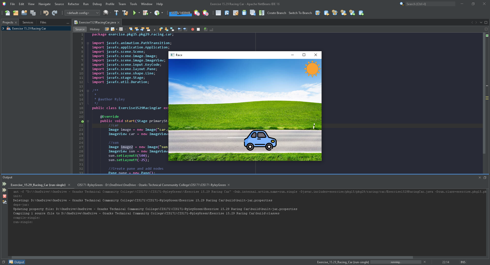

# GUI Informational Display

A car moving across the screen with speed controls

## Example Output

## Analysis Steps

Use the JavaFX API Libraries. Create a car that has controls for pause/play and faster/slower.
You may use image files, if you desire
Experiment with JavaFX - add a skin

### Design

I used a stylesheet to add a background then used two more images, one for the car and another for the sun.

### Testing

I tested each node multiple times while adusting their coordinates
once the still image was in place I tested the animation for motion to the other side of the scene
after the animation was correct I added and tested the required pause/play and speed controls

## Adapted from a README Built With

* [Dropwizard](http://www.dropwizard.io/1.0.2/docs/) - The web framework used
* [Maven](https://maven.apache.org/) - Dependency Management
* [ROME](https://rometools.github.io/rome/) - Used to generate RSS Feeds

## Contributing

Please read [CONTRIBUTING.md](https://gist.github.com/PurpleBooth/b24679402957c63ec426) for details on our code of conduct, and the process for submitting pull requests to us.

## Versioning

We use [SemVer](http://semver.org/) for versioning. For the versions available, see the [tags on this repository](https://github.com/your/project/tags). 

## Authors

* **Billie Thompson** - *Initial work* - [PurpleBooth](https://github.com/PurpleBooth)

See also the list of [contributors](https://github.com/your/project/contributors) who participated in this project.

## License

This project is licensed under the MIT License - see the [LICENSE.md](LICENSE.md) file for details

## Acknowledgments

* Hat tip to anyone who's code was used
* Inspiration
* etc
