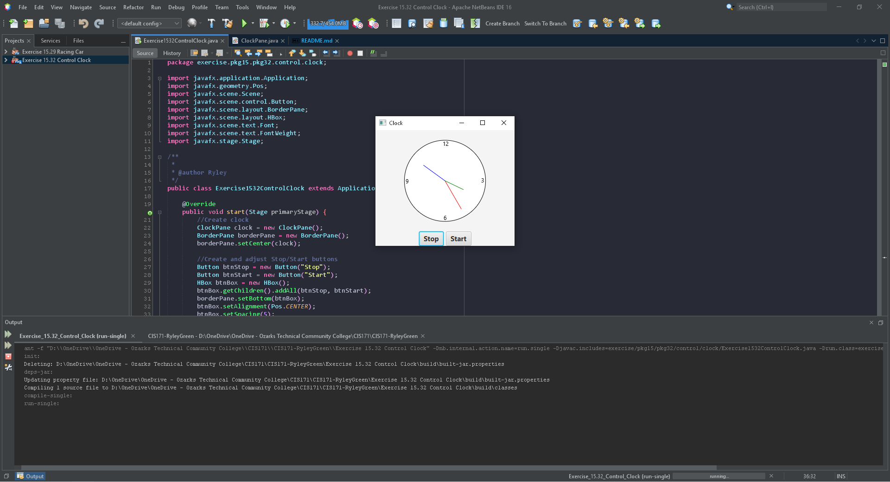

# Exercise 15.32 Control Clock

A working clock with a stop and start button

## Example Output

## Analysis Steps

Modify the given ClockPane class to add animation to have a working clock. Add stop and start methods to stop and start the clock with two buttons.

### Design

I used the given class to create the initial clock then modified it to have animation using Timeline(). Three additional methods were added to the ClockPane class, progress() which helped the animation,
stop() which stopped the animation, and start() that started the animation.

### Testing

The first test was to get the original clock painted correctly in a scene.

Once the clock was correct, I added buttons and adjusted the placement.

The clock animation using Timeline was next which worked well

then the Stop/Start methods for the buttons which had one issue with the placement of the initial Timeline

after changing the placement of the Timeline both the buttons and animation functioned correctly.

## Adapted from a README Built With

* [Dropwizard](http://www.dropwizard.io/1.0.2/docs/) - The web framework used
* [Maven](https://maven.apache.org/) - Dependency Management
* [ROME](https://rometools.github.io/rome/) - Used to generate RSS Feeds

## Contributing

Please read [CONTRIBUTING.md](https://gist.github.com/PurpleBooth/b24679402957c63ec426) for details on our code of conduct, and the process for submitting pull requests to us.

## Versioning

We use [SemVer](http://semver.org/) for versioning. For the versions available, see the [tags on this repository](https://github.com/your/project/tags). 

## Authors

* **Billie Thompson** - *Initial work* - [PurpleBooth](https://github.com/PurpleBooth)

See also the list of [contributors](https://github.com/your/project/contributors) who participated in this project.

## License

This project is licensed under the MIT License - see the [LICENSE.md](LICENSE.md) file for details

## Acknowledgments

* Hat tip to anyone who's code was used
* Inspiration
* etc
