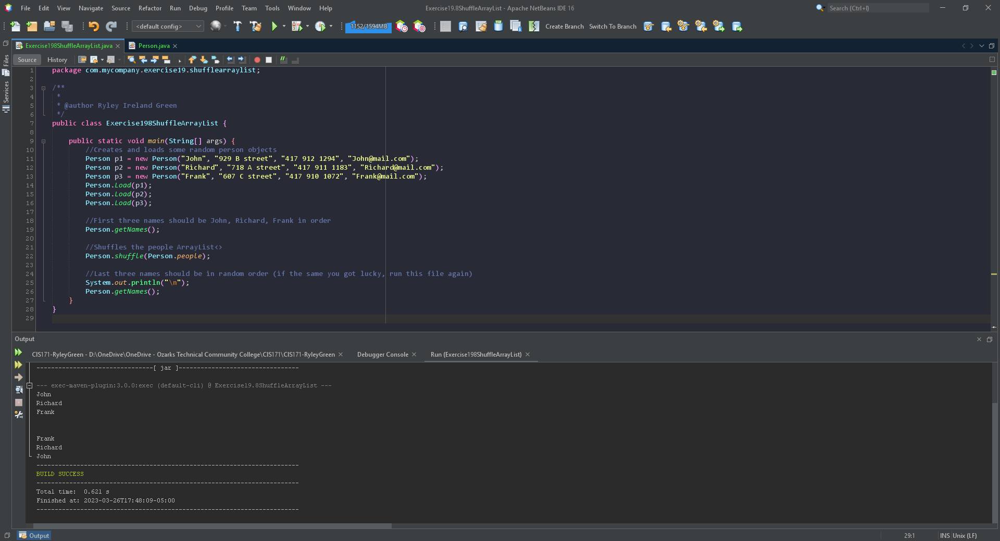

# Exercise 19.8 Shuffle ArrayList

A Person class with the ability to create person objects and sort and shuffle them into an ArrayList<>.

## Example Output

## Analysis Steps

Create the Person class with the ability to create objects then add the functionality to shuffle the order in the ArrayList<>/

### Design

Person class with a constructor for a person object, getter and setters, method for shuffling and another class for testing purposes.

### Testing

The first test was done by creating one person then grabbing the given name as output.

then creating a couple more names and using a load method tested by grabbing and outputting names from the ArrayList<>.

final test was done by having two outputs one before shuffle and a second after shuffling the ArrayList<>.

## Adapted from a README Built With

* [Dropwizard](http://www.dropwizard.io/1.0.2/docs/) - The web framework used
* [Maven](https://maven.apache.org/) - Dependency Management
* [ROME](https://rometools.github.io/rome/) - Used to generate RSS Feeds

## Contributing

Please read [CONTRIBUTING.md](https://gist.github.com/PurpleBooth/b24679402957c63ec426) for details on our code of conduct, and the process for submitting pull requests to us.

## Versioning

We use [SemVer](http://semver.org/) for versioning. For the versions available, see the [tags on this repository](https://github.com/your/project/tags). 

## Authors

* **Billie Thompson** - *Initial work* - [PurpleBooth](https://github.com/PurpleBooth)

See also the list of [contributors](https://github.com/your/project/contributors) who participated in this project.

## License

This project is licensed under the MIT License - see the [LICENSE.md](LICENSE.md) file for details

## Acknowledgments

* Hat tip to anyone who's code was used
* Inspiration
* etc
