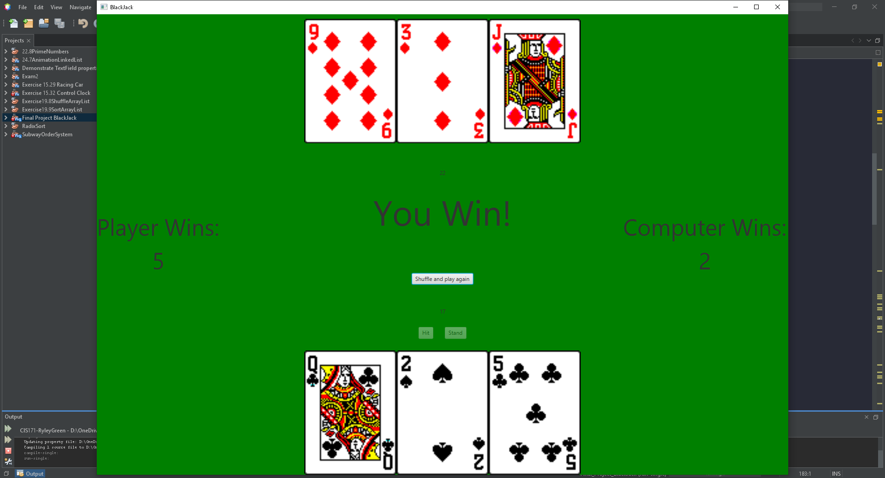

# Final Project: BlackJack

A game of blackjack versus a computer.

## Example Output

## Analysis Steps

The game of Blackjack requires the input of the user for when to hit, stand, and decide ace values to get the closest to 21 as they can. 
The house/computer also needs a way to decide hit, stand, and ace values based on the player’s hand. 
Then the display of total wins by each the computer and player then also shuffling the deck for another round.

### Design

First layout the buttons and where the player's cards will go. Then read all the card images from a folder and store them into an array. 
A counter to keep track of the location in the deck you are out of 52. 
When the card is chosen and placed into the player’s hand it goes through a check to find the value based on the given file name. 
Then functionality for the stand button was given and the computer goes through the same methods but a bit of alteration and the ability to win and lose was added.
The total amount of wins is displayed for both the player and computer.

### Testing

First a test was done to see cards appear into the player’s hand. Then a counter was added to keep track of card values, so that I know they received the right values.  
Then win conditions were tested “specifically losing after 21” then functionality was added to play against a computer and the stand button acted like a switch to computer’s turn.  
Testing the images added to the computers hand then the values (went on the same method as players.) 
Then adding the shuffle button at the end and total wins was tested by playing multiple games with the computer.

## Adapted from a README Built With

* [Dropwizard](http://www.dropwizard.io/1.0.2/docs/) - The web framework used
* [Maven](https://maven.apache.org/) - Dependency Management
* [ROME](https://rometools.github.io/rome/) - Used to generate RSS Feeds

## Contributing

Please read [CONTRIBUTING.md](https://gist.github.com/PurpleBooth/b24679402957c63ec426) for details on our code of conduct, and the process for submitting pull requests to us.

## Versioning

We use [SemVer](http://semver.org/) for versioning. For the versions available, see the [tags on this repository](https://github.com/your/project/tags). 

## Authors

* **Billie Thompson** - *Initial work* - [PurpleBooth](https://github.com/PurpleBooth)

See also the list of [contributors](https://github.com/your/project/contributors) who participated in this project.

## License

This project is licensed under the MIT License - see the [LICENSE.md](LICENSE.md) file for details

## Acknowledgments

* Hat tip to anyone who's code was used
* Inspiration
* etc
