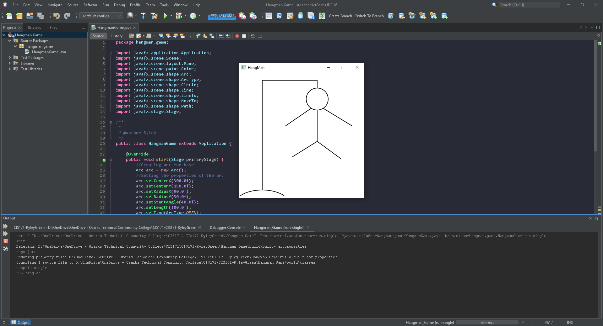

# Week04 Exam: Unit 1 Project - Hangman Game

A display of a drawn hangman game using JavaFX.

## Example Output

## Analysis Steps

Use the JavaFX API Libraries. Create a display that shows a completed hangman game.

### Design

I used an arc for the base, lines within paths for the hang and body/arms, and finally a circle for the head.

### Testing

With each shape added the program was tested for visibility in the scene.
After each shape was added it was then tested mutliple times while altering the coordinates and other values.
once everything was in place the program was ran once more to test the final shape placements.

## Adapted from a README Built With

* [Dropwizard](http://www.dropwizard.io/1.0.2/docs/) - The web framework used
* [Maven](https://maven.apache.org/) - Dependency Management
* [ROME](https://rometools.github.io/rome/) - Used to generate RSS Feeds

## Contributing

Please read [CONTRIBUTING.md](https://gist.github.com/PurpleBooth/b24679402957c63ec426) for details on our code of conduct, and the process for submitting pull requests to us.

## Versioning

We use [SemVer](http://semver.org/) for versioning. For the versions available, see the [tags on this repository](https://github.com/your/project/tags). 

## Authors

* **Billie Thompson** - *Initial work* - [PurpleBooth](https://github.com/PurpleBooth)

See also the list of [contributors](https://github.com/your/project/contributors) who participated in this project.

## License

This project is licensed under the MIT License - see the [LICENSE.md](LICENSE.md) file for details

## Acknowledgments

* Hat tip to anyone who's code was used
* Inspiration
* etc
