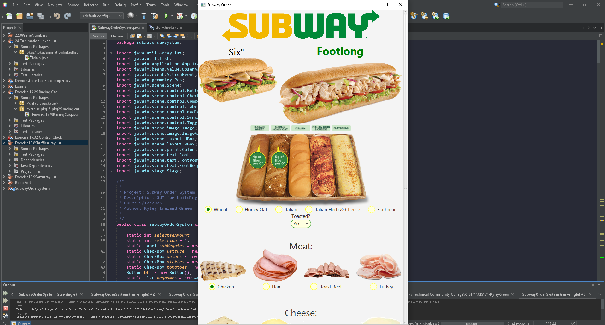
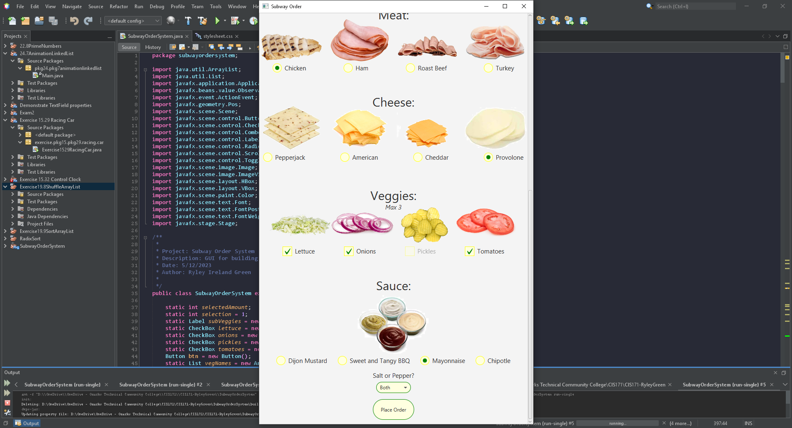
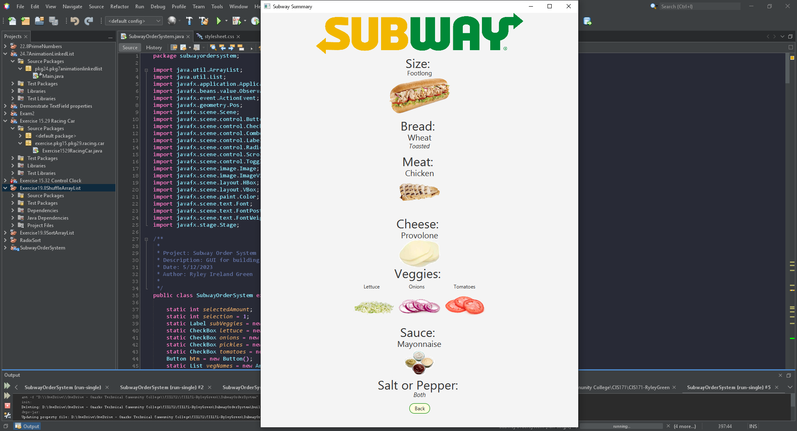

# Subway Proctored Event Assignment

Automated ordering system for subway, using a GUI to interact with a user to build a sandwhich.

## Example Output

## Analysis Steps

Build a GUI that incorporates a user choosing
Size of sandwich,
Type of bread,
Type of meat,
Type of cheese,
Up to three veggies,
Type of Sauce, and
Salt & Pepper (Y/N)

### Design

I built the GUI to have many options for a sandwhich going verticly with the ability to scroll. Then creating a second scene to display the chosen options once the user selects the order button.
A back button was also added to the summary page for functionality. A stylesheet was added to customize radio buttons, combo boxes, check boxes, and buttons. the theme was targeted towards subways colors of green and yellow on white.

### Testing

Many tests were made while placeing and adjusting node positions.
the most testing was done whith getting the check boxes to only accept a max of three at a time.
more testing for node placements and second scene creation and display.
finally testing was done while changeing and applying subway themes to some nodes.

## Adapted from a README Built With

* [Dropwizard](http://www.dropwizard.io/1.0.2/docs/) - The web framework used
* [Maven](https://maven.apache.org/) - Dependency Management
* [ROME](https://rometools.github.io/rome/) - Used to generate RSS Feeds

## Contributing

Please read [CONTRIBUTING.md](https://gist.github.com/PurpleBooth/b24679402957c63ec426) for details on our code of conduct, and the process for submitting pull requests to us.

## Versioning

We use [SemVer](http://semver.org/) for versioning. For the versions available, see the [tags on this repository](https://github.com/your/project/tags). 

## Authors

* **Billie Thompson** - *Initial work* - [PurpleBooth](https://github.com/PurpleBooth)

See also the list of [contributors](https://github.com/your/project/contributors) who participated in this project.

## License

This project is licensed under the MIT License - see the [LICENSE.md](LICENSE.md) file for details

## Acknowledgments

* Hat tip to anyone who's code was used
* Inspiration
* etc
